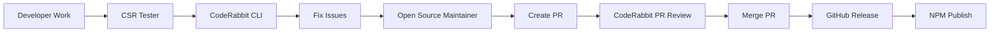

# Claude Self-Reflect - Action Guide

## ⚠️ BREAKING CHANGES (v3.x → v4.0)

### Critical Migration Required
**⚠️ STOP**: If upgrading from v3.x, read this first!

#### Hash Algorithm Migration
- **Old**: MD5 IDs (legacy support enabled)
- **New**: SHA-256 + UUID for new conversations
- **Action**: Run `python scripts/migrate-ids.py` after backup

#### Embedding Dimensions
- **Local**: 384 dimensions (FastEmbed)
- **Cloud**: 1024 dimensions (Voyage)
- **Warning**: Collections are NOT cross-compatible
- **Action**: Rebuild collections if switching modes

#### Authentication Changes
- **New**: Qdrant requires authentication
- **Action**: Update `.env`: `QDRANT_API_KEY="your-key"`
- **Deadline**: Old connections fail after 2025-12-01

#### Async Pattern Changes
- **Old**: Threading-based operations
- **New**: Full asyncio implementation
- **Action**: Update custom scripts using the API

#### Collection Naming
- **Old**: Simple project names
- **New**: Prefixed naming
  - Local mode: `csr_project_local_384d` (384 dimensions)
  - Cloud mode: `csr_project_cloud_1024d` (1024 dimensions)
- **Action**: Run `python scripts/migrate-collections.py`

### Migration Checklist (v4.x → v5.0 with Unified State)
- [ ] Backup Qdrant data: `python scripts/backup-qdrant.py`
- [ ] Run ID migration: `python scripts/migrate-ids.py`
- [ ] Update collection names: `python scripts/migrate-collections.py`
- [ ] Add authentication: `python scripts/migrate-auth.py`
- [ ] Migrate to unified state: `python scripts/migrate-unified-state.py --dry-run` then without flag
- [ ] Test search functionality
- [ ] Verify all agents working

## 🎯 Primary Actions (Use These Daily)

### Search Past Conversations
```python
# Primary search tool - use liberally!
reflect_on_past("docker compose issues")

# Quick existence check
quick_search("have we discussed authentication?")

# Get insights without details
search_summary("performance optimization patterns")
```

### Check System Health
```bash
# Is everything working?
python mcp-server/src/status.py  # Real import status
docker ps | grep qdrant          # Vector DB running?
```

### Import New Conversations
```bash
source venv/bin/activate
python scripts/import-conversations-unified.py --limit 5  # Test first
python scripts/import-conversations-unified.py           # Full import
```

## ⚠️ Critical Rules

1. **PATH RULE**: Always use `/Users/username/...` never `~/...` in MCP commands
2. **TEST RULE**: Never claim success without running tests
3. **IMPORT RULE**: If status.py shows imports working, trust it (not other indicators)
4. **RESTART RULE**: After modifying MCP server code, restart Claude Code entirely

## 🔧 One-Time Setup

### Add MCP to Claude Code
```bash
# CRITICAL: Replace YOUR_USERNAME with actual username
claude mcp add claude-self-reflect \
  "/Users/YOUR_USERNAME/projects/claude-self-reflect/mcp-server/run-mcp.sh" \
  -e QDRANT_URL="http://localhost:6333" \
  -e QDRANT_API_KEY="your-key-if-auth-enabled" \
  -s user
```

### Start Required Services
```bash
docker compose up -d qdrant  # Vector database
docker start claude-reflection-safe-watcher  # Auto-importer
```

## 🚨 Troubleshooting Matrix

| Symptom | Check | Fix |
|---------|-------|-----|
| No search results | `docker ps \| grep qdrant` | `docker compose up -d qdrant` |
| Tools not available | `claude mcp list` | Remove & re-add MCP, restart Claude |
| Import shows 0% | Test with `reflect_on_past` | If search works, ignore the 0% |
| "spawn ~ ENOENT" | Check MCP path has `~` | Use full path `/Users/...` |

## 📁 Key Files

| What | Where | Purpose |
|------|-------|---------|
| Conversations | `~/.claude/projects/*/` | Source JSONL files |
| Unified state | `~/.claude-self-reflect/config/unified-state.json` | Single source of truth (v5.0) |
| State manager | `scripts/unified_state_manager.py` | Unified state management |
| MCP server | `mcp-server/src/server.py` | Main server (728 lines) |

## 🤖 Agent Activation Keywords

Say these to auto-activate specialized agents:
- "import showing 0 messages" → import-debugger
- "search seems irrelevant" → search-optimizer
- "find conversations about X" → reflection-specialist
- "Qdrant collection issues" → qdrant-specialist
- "quality issues detected" → quality-fixer
- "docker services fail" → docker-orchestrator
- "MCP tools not working" → mcp-integration
- "performance issues" → performance-tuner
- "test installations" → reflect-tester
- "release management" → open-source-maintainer

## 🔧 Quality Automation

### AST-GREP Integration
The system now includes comprehensive AST-GREP pattern analysis:
- **Unified Registry**: 100+ patterns for Python/TypeScript
- **Auto-fix**: Safe pattern fixes applied automatically
- **Quality Gates**: Pre-commit and post-generation hooks
- **Command**: `/fix-quality` to run quality fixer

### Hooks System
Automated hooks for quality control:
```bash
# Pre-commit: Updates quality cache
.claude/hooks/pre-commit

# Post-generation: Tracks edits and runs analysis
.claude/hooks/post-generation
```

### Quality Commands
```bash
# Run quality analysis
python scripts/ast_grep_final_analyzer.py

# Apply safe fixes
python scripts/ast_grep_final_analyzer.py --fix

# Check quality gate
python scripts/quality-gate.py --threshold 10

# Session quality tracking
python scripts/session_quality_tracker.py
```

## 🔄 Unified State Management (v5.0)

### Migration to Unified State
```bash
# Run migration (backs up old files automatically)
python scripts/migrate-to-unified-state.py

# Preview changes without applying
python scripts/migrate-to-unified-state.py --dry-run

# Rollback if needed
python scripts/migrate-to-unified-state.py --rollback
```

### Benefits
- **50% faster** status checks (1.2ms for 1000 files)
- **50% less storage** (automatic deduplication)
- **Zero race conditions** (atomic operations with locking)
- **Single source of truth** (one JSON file instead of 5+)

## Mode Switching (Runtime, No Restart!)
```python
# Switch embedding modes without restarting
switch_embedding_mode(mode="cloud")  # Voyage AI, better accuracy
switch_embedding_mode(mode="local")  # FastEmbed, privacy-first
get_embedding_mode()                 # Check current mode
```

## 🚀 Complete Development & Release Workflow

### The Full Pipeline: Code → Test → Review → Release → NPM



### 1. Development Phase
**WHO**: Developer (You)
**WHAT**: Write code, fix bugs, add features
**HOW**:
```bash
# Create feature branch
git checkout -b fix/issue-description

# Make changes
# ... coding ...

# Run local tests
python mcp-server/src/status.py
```

### 2. Testing Phase
**WHO**: CSR Tester Agent
**WHAT**: Validate system functionality
**HOW**: Automatically activated with "test installations" or manually run
```bash
# CSR Tester runs comprehensive validation
# - MCP tools testing
# - Security scans
# - Performance checks
# - CodeRabbit CLI analysis (if terminal compatible)
```

### 3. Code Review Phase
**WHO**: CodeRabbit (Automated)
**WHAT**: Identify code issues, bugs, improvements
**HOW**:
```bash
# Option A: CLI (has terminal mode issues currently)
script -q /dev/null coderabbit --prompt-only

# Option B: PR Comments (RECOMMENDED)
gh pr view [PR_NUMBER] --comments | grep -A 10 "coderabbitai"
```

### 4. Fix Phase
**WHO**: Developer (You)
**WHAT**: Address all CodeRabbit-identified issues
**HOW**:
```bash
# Fix issues locally
# Commit changes
git add .
git commit -m "fix: address CodeRabbit feedback"
```

### 5. Release Management Phase
**WHO**: Open Source Maintainer Agent
**WHAT**: Create PR, manage release, publish to NPM
**WORKFLOW**:

```bash
# Step 1: Create PR with fixes
gh pr create --title "fix: address CodeRabbit issues" \
  --body "Fixes identified by CodeRabbit analysis"

# Step 2: Monitor CodeRabbit PR review
gh pr view [PR_NUMBER] --comments

# Step 3: Merge when approved
gh pr merge [PR_NUMBER]

# Step 4: Create GitHub Release
VERSION="v5.0.1"
gh release create $VERSION \
  --title "$VERSION - CodeRabbit Fixes" \
  --notes "Fixed issues identified by CodeRabbit"

# Step 5: Monitor NPM Publication (automated)
gh run watch  # Watch CI/CD publish to NPM

# Step 6: Verify NPM Package
npm view claude-self-reflect@latest version
```

### 6. Post-Release Phase
**WHO**: Open Source Maintainer Agent
**WHAT**: Close issues, update docs, announce
**HOW**:
```bash
# Close related issues
gh issue close [ISSUE_NUMBER] --comment "Fixed in $VERSION"

# Update documentation
# Announce in discussions
```

## 🔍 Code Review with CodeRabbit

### AI Agent Workflow (Recommended)
```bash
# For AI coding agents - optimized token-efficient output
coderabbit --prompt-only

# This creates a powerful workflow:
# 1. CodeRabbit identifies problems with full codebase context
# 2. AI agent (Claude) implements the fixes
# 3. Expert-level issue detection + AI-powered implementation
```

### Command Reference
```bash
# Interactive mode (default)
coderabbit

# Plain text detailed feedback
coderabbit --plain

# Minimal output for AI agents (BEST FOR CLAUDE)
coderabbit --prompt-only

# Short alias works too
cr --prompt-only
```

### Additional Options
```bash
# Review specific types
coderabbit --type all          # Review everything (default)
coderabbit --type committed    # Only committed changes
coderabbit --type uncommitted  # Only uncommitted changes

# Compare against base
coderabbit --base main                    # Compare to branch
coderabbit --base-commit HEAD~2          # Compare to commit

# Additional config
coderabbit --config claude.md coderabbit.yaml

# Disable colors
coderabbit --no-color
```

### GitHub PR Integration (Alternative)
```bash
# Check PR comments for CodeRabbit feedback
gh pr view [PR_NUMBER] --comments | grep -A 10 "coderabbitai"
```

**Note:** PR reviews and CLI reviews will differ - CLI optimizes for immediate development feedback, while PR reviews provide comprehensive team collaboration context.

---
*Architecture details, philosophy, and history → See `docs/`*
*Full command reference → See `docs/development/MCP_REFERENCE.md`*